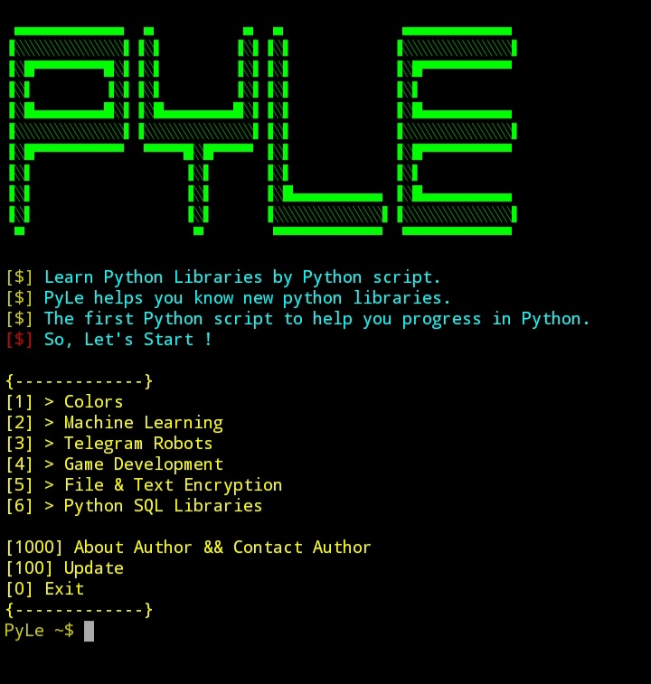

# PyLe
'Learn and introduce Python libraries with PyLe'

We all know that there are many Python libraries. 
Sometimes we have to go through a lot of problems to 
find the right library.
There are many sites that introduce you to Python libraries. 
But their problem is that they can not introduce libraries with proper categories.
PyLe is here to helps you !
I have many ideas for PyLe, But i need to know someone know my script.
So, If you like PyLe idea help me improve it :)

### What's meaning of PyLe?
PyLe > Python Learning

### Requirements :
- python v3
- pip install colorama

### Main Menu :

1. Colors (Color output in Python)
2. Machine Learning
3. Telegram Robots
4. Game Development
5. File & Text Encryption
6. Python SQL Libraries

1000. About Author
100. Update
0. Exit  

### Colors :
1. Nmap
2. WPScan
3. CMS Scanner
4. XSStrike

### Machine Learning :
1. Cupp
2. Ncrack
3. CeWL

### Telegram Robots :
1. Aircrack-ng
2. Wifite
3. Kismet

### Game Development :
1. Commix
2. ATSCAN
3. Sqlmap
4. Metasploit

### File & Text Encryption :
1. Responder
2. Mitmproxy

### Python SQL Libraries :
1. Nikto
2. Joomscan
3. Vbscan

### Installation :
Easy installation :
git clone https://github.com/AnonC0DER/PyLe.git

### Donation : 
15v1b5gsjMKkvVLRWjCxb8pzFvXjyWQBQ8

### Screenshot : 

Contact me : 
AnonCODER@tutanota.com
telegram : @AnonC0DER
