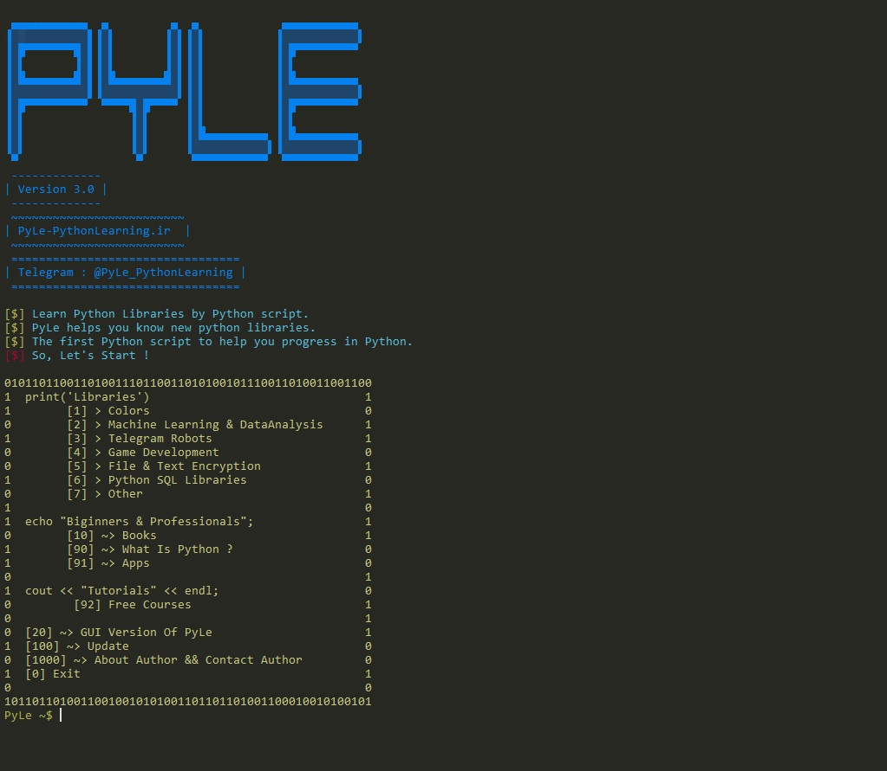

### Bete Version Of PyLe-GUI is Ready !
## Use PyQt5 and pyinstaller for exe file.
Now You Can Use PyLe-GUI.
This is the first version of PyLe-GUI So, new updates are comming... :)
Please Send me your ideas for PyLe project.
If there is any bug, Let me know.
> (Tested On Windows 7,10 64bit) 

## Download Exe File :
- https://pyle-pythonlearning.ir/downloads/apps/PyLeGUI/PyLeGUI.rar

## Download Python Source :
- https://pyle-pythonlearning.ir/downloads/apps/PyLeGUI/PyLeGUI-PythonSource.zip
- https://github.com/AnonC0DER/PyLe/raw/main/PyLeGUI/PyLeGUI-PythonSource.zip

# Requirements for python source :
- PyQt5 (pip install PyQt5)

### All ideas :
- [x] Use Json data for shorter code
- [x] GUI Version
- [ ] Make it optimal

### New Update 2.0 !
- Apps section Added !
- Bug Fixes

# PyLe
'Learn and introduce Python libraries with PyLe'

We all know that there are many Python libraries. 
Sometimes we have to go through a lot of problems to 
find the right library.
There are many sites that introduce you to Python libraries. 
But their problem is that they can not introduce libraries with proper categories.
PyLe is here to helps you !
I have many ideas for PyLe, But i need to know someone know my script.
So, If you like PyLe idea help me improve it :)

### Installation :
Easy installation :
- Linux :
- git clone https://github.com/AnonC0DER/PyLe.git
- Windows:
- Use Cmder application (You can download it in PyLe)

### Version 2.0

### What's meaning of PyLe?
PyLe > Python Learning

### Requirements :
- python v3
- pip install colorama

### Main Menu :

1. Colors (Color output in Python)
2. Machine Learning
3. Telegram Robots
4. Game Development
5. File & Text Encryption
6. Python SQL Libraries

1000. About Author
100. Update
0. Exit  

### Colors :
1. => Colored
2. => Colorma
3. => Termcolor

### Machine Learning :
1. => Scikit-learn
2. => Keras 
3. => Xgboost
4. => Statsmodels
5. => Tensorflow 

### Telegram Robots :
1. => Python-telegram-bot
2. => Pyrogram
3. => Telegram

### Game Development :
1. => Pygame
2. => Turtles
3. => PyOpenGL

### File & Text Encryption :
1. => Cryptography
2. => Pycrypto 
3. => pyAesCrypt

### Python SQL Libraries :
1. => SQLite
2. => MySQL 
3. => PostgreSQL

### For Beginners :
1. => Books
2. => What Is Python ?
3. Apps

### Donation for PyLe Website : 
15v1b5gsjMKkvVLRWjCxb8pzFvXjyWQBQ8

### Screenshot : 

Contact me : 
AnonCODER@tutanota.com
telegram : @AnonC0DER
