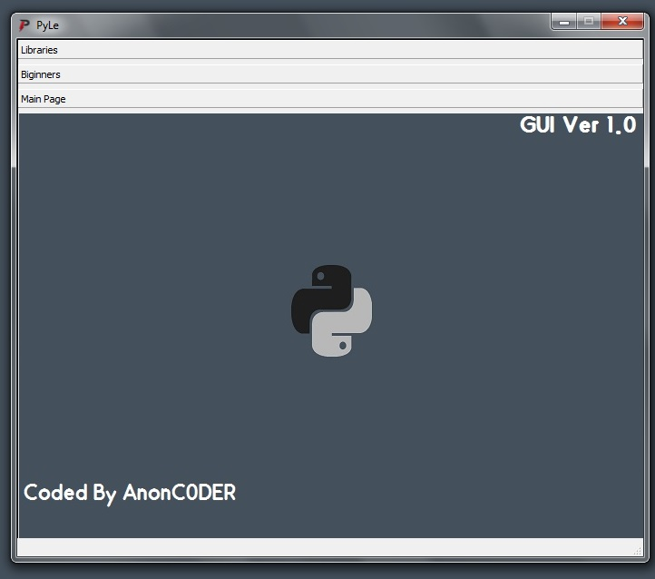

# PyLe
## What's meaning of PyLe?
> Learn and introduce Python libraries with PyLe
We all know that there are many Python libraries.  
Sometimes we have to go through a lot of problems to find the right library.  
There are many sites that introduce you to Python libraries.  
But their problem is that they can not introduce libraries with proper categories.  
PyLe is here to helps you ! 
I have many ideas for PyLe, But i need to know someone know my script. 
So, If you like PyLe idea help me improve it :) 
> Version 4.0

# Installation :
Easy installation :
- Linux :
- git clone https://github.com/AnonC0DER/PyLe.git
- Windows:
- Use Cmder application (You can download it in PyLe)

# Requirements :
- python v3
- pip install colorama

<-------------------------------------->
# PyLeRobot is ready (Telegram Robot)
Now you can use PyLe in your telegram account ! 
Easy & fast.
> [PyLeRobot](https://t.me/PyLeRobot)

# Updates News 
## New Update 4.0 !
- 7 new libraries in Other Section
- Search function Added (Now You can search libraries in PyLe) 
- Quit Time Added

## New Update for PyLeGUI ! (Version 2.0)
- Splash Screen Added !
- Other section Added 
- 6 Libraries Added to Machine Learning Section 

#### [Download Version 2.0](https://github.com/AnonC0DER/PyLe#the-first-version-of-pyle-gui-is-ready-)

> if You wanna know about next updates, please join PyLe's Telegram Channel.
- https://t.me/PyLe_PythonLearning

# Second Version Of PyLe Website
> Please support it with share it.
### https://pyle-pythonlearning.ir

# The Second Version Of PyLe-GUI is Ready !
## Use PyQt5 For Version 1.0, PySide2 For Version 2.0 and pyinstaller for exe file.
Please Send me your ideas for PyLe project.
If there is any bug, [Let me know](https://github.com/AnonC0DER/PyLe#contact-me-).
> (Tested On Windows 7,10 64bit) 

## Download Exe File :
- > Version 1.0 :
- [PyLeGUI v1.0](https://pyle-pythonlearning.ir/downloads/apps/PyLeGUI/PyLeGUI.rar)

- > Version 2.0 :
- [PyLeGUI v2.0](https://pyle-pythonlearning.ir/downloads/apps/PyLeGUI/PyLeGUI2.0.zip)

## Download Python Source :
- > Version 1.0 :
- [PyLeGUI-PythonSource v1.0](https://pyle-pythonlearning.ir/downloads/apps/PyLeGUI/PyLeGUI-PythonSource.zip)

- > Version 2.0 :
- [PyLeGUI-PythonSource 2.0](https://github.com/AnonC0DER/PyLe/raw/main/PyLeGUI/PyLeGUI-2.0(PythonSource).zip)

# Requirements for python source :
- Version 2.0 = PySide2 (pip install PySide2)
- Version 1.0 = PyQt5 (pip install PyQt5)

<-------------------------------------->

# All ideas :
- [x] Use Json data for shorter code
- [x] GUI Version
- [x] PyLe WebSite
- [X] Object-oriented programming
- [X] FreeCourses section Added
- [ ] Kind of suprise

# Main Menu :
## Libraries :
1. Colors (Color output in Python)
2. Machine Learning
3. Telegram Robots
4. Game Development
5. File & Text Encryption
6. Python SQL Libraries
7. Other

## Colors :
1. => Colored
2. => Colorma
3. => Termcolor

## Machine Learning :
1. => Scikit-learn
2. => Keras 
3. => Xgboost
4. => Statsmodels
5. => Tensorflow
6. => Numpy
7. => SciPy
8. => Matplotlib
9. => Seaborn
10. => PyTorch
11. => PyCaret

## Telegram Robots :
1. => Python-telegram-bot
2. => Pyrogram
3. => Telegram

## Game Development :
1. => Pygame
2. => Turtles
3. => PyOpenGL

## File & Text Encryption :
1. => Cryptography
2. => Pycrypto 
3. => pyAesCrypt

## Python SQL Libraries :
1. => SQLite
2. => MySQL 
3. => PostgreSQL

## Othres :
1. Os (Operating System)        
2. Subprocess                   
3. Urllib Request               
4. Requests                     
5. Tkinter                      
6. PyQt                         
7. MoviePy                      
8. datetime                     
9. Pendulum                     
10. Pillow                       
11. OpenCV Python                
12. Theano                       
13. Fire                         
14. Arrow                        
15. FlashText                    
16. wxPython                     
17. Cirq                         
18. Json                        
19. Sys
20. InstaPy
21. Cython
22. pytube
23. Typer
24. Rich
25. Dear PyGui
26. PrettyErrors
27. Diagrams
28. HiPlot
29. Selenium

## Biginners & Professionals :
10. Books
90. What Is Python ?
91. Apps

## Tutorials :
92. Free Courses

20. GUI Version Of PyLe
1000. About Author
1001. License
1002. Update
1003. Send 
1004. Exit  

<-------------------------------------->
# Donation : 
15v1b5gsjMKkvVLRWjCxb8pzFvXjyWQBQ8

# Screenshot : 

# Contact me : 
> AnonCODER@tutanota.com  
> telegram : @AnonC0DER
